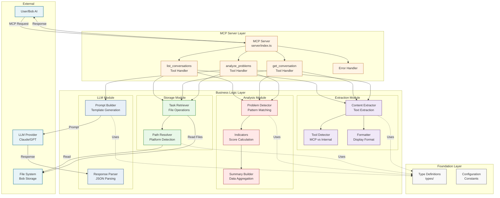
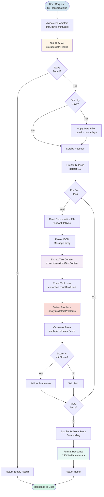
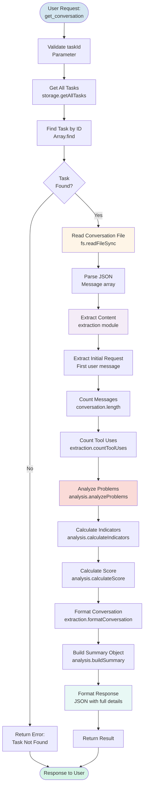
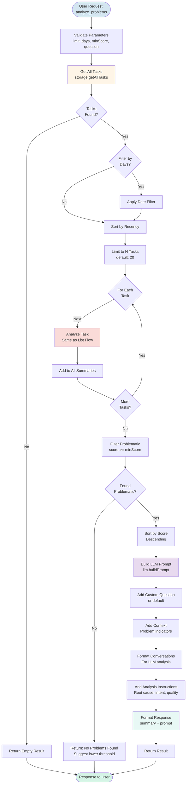
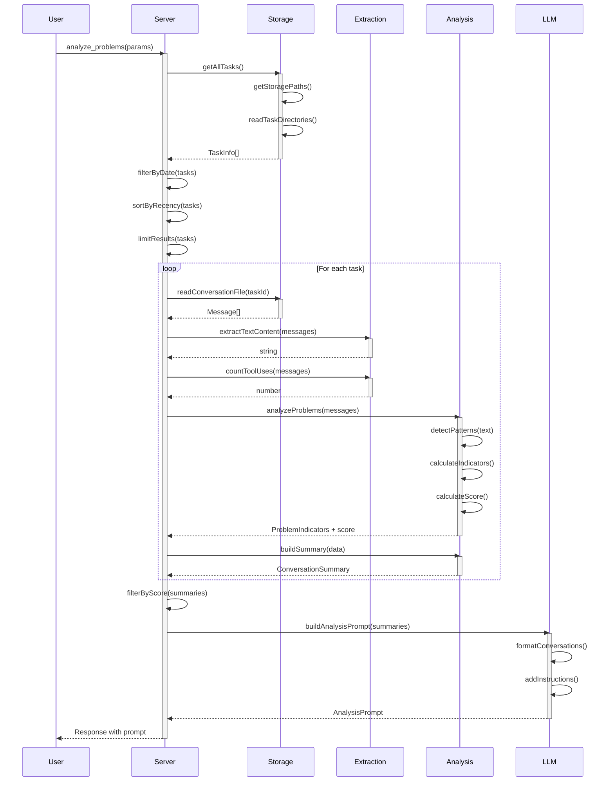
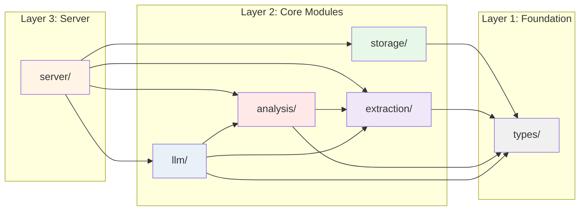

# Bob Insights - Architecture Specification

## 1. High-Level Component Diagram



## 2. Component Responsibilities

### External Layer
- **User/Bob AI**: Initiates requests through MCP protocol
- **File System**: Stores Bob conversation history
- **LLM Provider**: Analyzes conversations (optional, for deep analysis)

### MCP Server Layer
- **MCP Server**: Entry point, handles MCP protocol
- **Tool Handlers**: Implement business logic for each tool
- **Error Handler**: Centralized error handling and formatting

### Business Logic Layer

#### Storage Module
- **Path Resolver**: Detects platform and resolves storage paths
- **Task Retriever**: Reads conversation files from disk

#### Extraction Module
- **Content Extractor**: Extracts text from message structures
- **Tool Detector**: Identifies MCP vs internal tool usage
- **Formatter**: Formats conversations for display

#### Analysis Module
- **Problem Detector**: Applies regex patterns to detect issues
- **Indicators**: Calculates problem indicators and scores
- **Summary Builder**: Aggregates data into conversation summaries

#### LLM Module
- **Prompt Builder**: Generates analysis prompts for LLM
- **Response Parser**: Parses and validates LLM responses

### Foundation Layer
- **Type Definitions**: Shared TypeScript interfaces
- **Configuration**: Constants and configuration values

## 3. BPMN: List Conversations Flow



## 4. BPMN: Get Conversation Flow



## 5. BPMN: Analyze Problems Flow



## 6. Data Flow Between Modules



## 7. Module Dependencies



## 8. File Structure

```
bob-insights/
├── src/
│   ├── types/
│   │   ├── index.ts              # Re-exports
│   │   ├── conversation.ts       # Message, ContentBlock, ConversationSummary
│   │   ├── analysis.ts           # ProblemIndicators, AnalysisResult
│   │   └── storage.ts            # TaskInfo, StorageConfig
│   │
│   ├── storage/
│   │   ├── index.ts              # Re-exports
│   │   ├── path-resolver.ts      # getStoragePaths(), detectPlatform()
│   │   └── task-retriever.ts     # getAllTasks(), readConversation()
│   │
│   ├── extraction/
│   │   ├── index.ts              # Re-exports
│   │   ├── content-extractor.ts  # extractTextContent(), extractInitialRequest()
│   │   ├── tool-detector.ts      # isMcpTool(), countToolUses()
│   │   └── formatter.ts          # formatConversation()
│   │
│   ├── analysis/
│   │   ├── index.ts              # Re-exports
│   │   ├── problem-detector.ts   # detectProblems(), PROBLEM_PATTERNS
│   │   ├── indicators.ts         # calculateIndicators(), calculateScore()
│   │   └── summary-builder.ts    # buildSummary(), createConversationSummary()
│   │
│   ├── llm/
│   │   ├── index.ts              # Re-exports
│   │   ├── prompt-builder.ts     # buildAnalysisPrompt(), formatPromptAsText()
│   │   └── response-parser.ts    # parseAnalysisResponse()
│   │
│   ├── server/
│   │   ├── index.ts              # Server setup and initialization
│   │   ├── tools/
│   │   │   ├── list-conversations.ts
│   │   │   ├── get-conversation.ts
│   │   │   └── analyze-problems.ts
│   │   └── handlers/
│   │       └── error-handler.ts
│   │
│   └── index.ts                   # Main entry point
│
├── docs/
│   └── ARCHITECTURE.md            # This file
│
├── tests/
│   ├── storage/
│   ├── extraction/
│   ├── analysis/
│   └── llm/
│
├── package.json
├── tsconfig.json
└── README.md
```

## 9. Key Design Principles

### Single Responsibility
Each module has one clear purpose and reason to change.

### Dependency Inversion
High-level modules (server) depend on abstractions (types), not concrete implementations.

### Open/Closed
Modules are open for extension but closed for modification.

### Interface Segregation
Modules expose only what's needed through clean interfaces.

### Don't Repeat Yourself
Common functionality is centralized and reused.

## 10. Testing Strategy

### Unit Tests
- Test each module independently
- Mock dependencies
- Focus on business logic

### Integration Tests
- Test module interactions
- Test file system operations
- Test end-to-end flows

### Test Coverage Goals
- Types: 100% (compile-time)
- Storage: 90%+
- Extraction: 90%+
- Analysis: 95%+
- LLM: 85%+
- Server: 80%+

## 11. Migration Path

1. **Phase 1**: Create types/ module
2. **Phase 2**: Extract storage/ module
3. **Phase 3**: Extract extraction/ module
4. **Phase 4**: Extract analysis/ module
5. **Phase 5**: Extract llm/ module
6. **Phase 6**: Refactor server/ module
7. **Phase 7**: Update main index.ts
8. **Phase 8**: Add tests for each module
9. **Phase 9**: Update documentation
10. **Phase 10**: Deprecate old structure